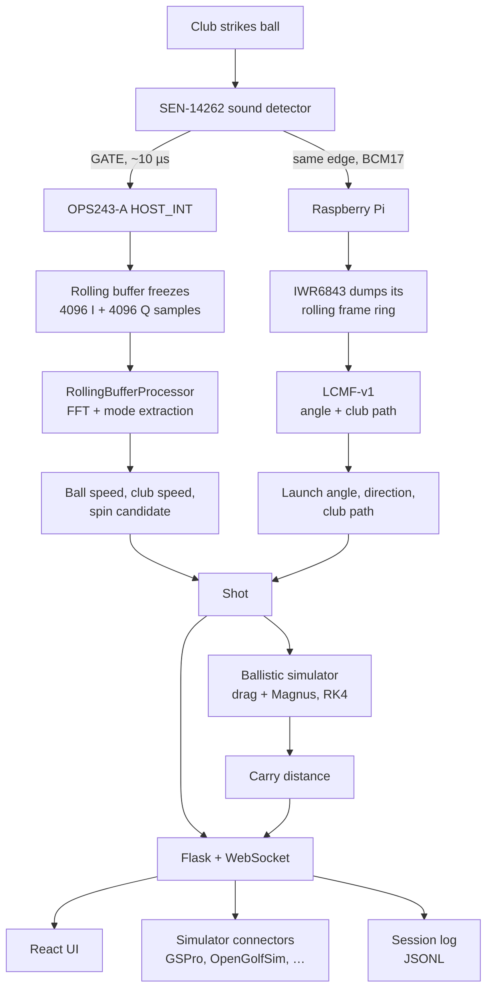

# Overview

How a swing becomes a row of numbers.

## What it measures

| Metric | Source | Trusted for carry? |
| --- | --- | --- |
| Ball speed | OPS243-A rolling-buffer I/Q, FFT mode extraction | Yes |
| Club speed | Pre-impact window of the same capture | Yes |
| Launch angle (vertical) | IWR6843, LCMF-v1 over the raw radar cube | Yes |
| Launch direction (horizontal) | IWR6843, horizontal plane | Yes |
| Club path | IWR6843, pre-impact frames | Reported, experimental |
| Spin rate | OPS243-A amplitude-envelope demodulation | **No** — experimental |
| Carry | RK4 ballistic simulation | Computed |

Smash factor and other derived values come from the measured pair.

## The chain

The important detail is that **one sound edge drives both radars**. The
SEN-14262's `GATE` output goes to the OPS243's `HOST_INT` pin in hardware — no
software in the path, roughly 10 µs of latency — and to the Pi's BCM17, which
asks the IWR6843 firmware to finish and dump its frame ring. Both captures
therefore describe the same strike, and the OPS impact timestamp is what
correlates them.

## Why Doppler

The OPS243-A transmits at 24.125 GHz. A moving object reflects that signal back
with its frequency shifted in proportion to speed — the Doppler effect. At this
frequency, **1 mph produces about a 71.7 Hz shift**, which is what makes a
modest FFT sufficient to resolve golf-ball speeds precisely.

The radar does not stream a speed number for the shot. It holds a rolling buffer
of raw I/Q samples; the trigger freezes it, and OpenFlight does the signal
processing itself. That is what allows club speed and ball speed to be pulled
from a single capture — they are different regions of the same timeline.

See [rolling buffer and spin detection](../how-it-works/rolling-buffer.md) for
what happens inside that capture.

## Why a second radar

Doppler measures speed *along the beam*. It cannot tell you the angle the ball
left at. The IWR6843 is a 60 GHz mmWave radar with multiple TX and RX antennas,
so it can resolve angle as well as range and velocity — which is what launch
angle, launch direction, and club path require.

It needs custom firmware: the stock TI demo does not expose the raw radar cube.
A validated prebuilt image ships in the repository, so flashing does not require
the TI toolchain.

## Accuracy

The July 2026 TrackMan baseline found ball speed and club speed are the strongest
numbers; launch angle is good within the estimator's stated limits; club path is
honest but coarse; spin is not yet trustworthy per-shot.

## Next

- **[Parts list](parts.md)** — what to buy
- **[Build order](build-order.md)** — the sequence
