# How OpenFlight Measures Launch Angle

!!! warning "DEPRECATED HARDWARE"

    This explains the **K-LD7** launch-angle method. The K-LD7 angle radars are
    deprecated; the supported angle radar is the TI IWR6843 — see
    [Launch angle](../how-it-works/launch-angle.md) for the current pipeline.
    Kept because the two-ray multipath reasoning here still explains why indoor
    launch angle is hard.

Why this is one of the hardest numbers to get out of a $40 radar, what the ground does to the signal, and how the **two-ray** method plus a two-tier confidence system turns a noisy reflection into a usable launch angle.

A plain-language explainer. No prior context needed. Physics terms are defined the first time they appear and collected in the glossary.

We point a small Doppler radar up the ball's flight to measure its **launch angle** (how steeply it leaves the face). The problem: the radar also sees the ball's **reflection off the floor** — a mirror-image ball that appears below the surface, the way a tree hangs upside-down in a still lake. Those two signals blend together and drag the measured angle **too low**.

The **two-ray method** mathematically pulls the real ball apart from its floor-reflection. When that separation is clean — which we expect over a **hard, flat surface** (an indoor floor, or a mat on concrete) — we trust the geometry directly (**Tier 1**). When it isn't — typically a **soft, scattering surface** like grass — we fall back to a lower-confidence estimate and, if the shot reads suspiciously flat, **nudge it up** toward what that club normally launches (**Tier 2**). The surface, not the venue, is what really decides it — though so far only the indoor case is measured.

## 1. The job & the hardware

Launch angle is the vertical angle the ball leaves the clubface. A 7-iron tour average is about **16°**; a driver about **10°**; a wedge can be **30°+**. Get it wrong by a few degrees and the simulated carry distance is off by yards.

OpenFlight measures it with a **K-LD7**: a 24 GHz **FSK Doppler radar** the size of a matchbox. It sits low, near the tee, **aimed up the flight line**. Every frame it gives us **two independent readings** of the ball — an **angle** and a **range** — and the launch-angle pipeline leans on both.

*The setup, to scale.* Radar 5 ft behind the ball, net 10 ft in front of it (15 ft from the radar). Over this short window the ball climbs in a near-straight line at its launch angle — the trajectory only curves into an arc much farther downrange. The slope of that climb is what we measure, from the **two frames** we typically get before the ball reaches the net (here at 25 ms and 54 ms — see limit ①). The dashed line is the radar's aim (boresight); the ball flies below it through this whole window. (A separate horizontal radar handles left/right aim; this document is only about the **vertical** launch-angle radar.)

### Reading 1 · the angle — where the ball sits in the beam

The radar has **two receive antennas**; the tiny **phase difference** between them encodes the ball's **elevation angle** each frame (this is **interferometry**). Stack those angles over the first few feet and the **rise** of the climb is the launch angle. It's the headline number — and the one a floor reflection corrupts (sections 2–3).

### Reading 2 · the range — how far the ball is

Being an **FSK** radar, the K-LD7 also reports the ball's **distance** (slant range) every frame, from the phase of a second transmit frequency. Three things make it the quiet workhorse of the whole method:

- **It's accurate — and largely multipath-immune.** Range is a *distance* (time-of-flight), which the floor bounce barely shifts; the angle, by contrast, arrives off the floor from a completely different direction and gets wrecked. So the range is the one **clean, trustworthy clock** in the signal.
- **It pins the moment of impact.** The ball's range grows steadily as it flies — extend that line back to the tee distance (~5 ft) and you've found **when impact happened**, the timing anchor everything else hangs off. (Range + elevation each frame also fix the ball's actual position, which is what Tier 1 fits a line through.)
- **It comes in sub-frames.** Each ~29 ms frame is sliced into about a dozen **overlapping short windows**, each yielding its own range sample — finer timing than one reading per frame, which sharpens that impact anchor.

*One frame, many range samples.* The radar steps 13 **overlapping short windows** across each ~29 ms frame, and the frames run **back-to-back with no gap**; every window yields its own range dot (gold). That dense, climbing track is fit to a line and run back to the tee distance (~5 ft) to pin the moment of impact, and it stays below the 16.4 ft wrap indoors. Only the **range** sub-divides like this — the **angle** is read once per frame (the sub-frame fringe it carries is consumed by the two-ray fit in section 4 rather than kept as a track).

Range has just one catch — it **wraps** past 16.4 ft — which is limit ② below.

## 2. Three hard limits of the K-LD7

Everything downstream exists to work around these. None of them is a bug — they're the physics of a cheap, short-range radar.

### ① You get one or two usable frames — and can't choose when

The radar free-runs at about **35 frames per second** — one frame every **~29 ms**, on *its* clock. Impact lands at a random point in that cycle, so **we can't pick when frames arrive**; "give me a frame at 20 ms" isn't an option. Indoors, with a net ~10 ft away, the ball is in clean view for only a fraction of a second — room for **two frames at best**.

- **Best case — 2 frames.** Two frames land inside the clean window, e.g. **25 ms** and **54 ms** after impact (one 29 ms step apart). Two points plus the known tee define the climb — the only road into **Tier 1**.
- **Common case — 1 frame.** If a frame fires **right at contact**, the ball is still on the tee in the radar's blind/clutter zone, so that slot is wasted — leaving a single usable frame. One frame can't show a climb, so it routes to a single-frame **Tier 2** estimate.

There's no "collect more data" lever: 35 Hz is the radar's ceiling, and the impact-to-frame timing is luck of the draw.

*It's the luck of the timing.* The 29 ms spacing is fixed by the radar, but where impact lands within that cycle is random shot-to-shot. Catch two frames in the clean window and Tier 1 is on the table; lose one to the moment of contact and you're left with a single-frame Tier 2 estimate. We can't request a frame at a chosen time.

### ② Range "wraps" past 16.4 ft

The radar measures distance using a phase that resets every cycle. At the 5 m range setting, that cycle covers **16.4 ft**. A ball truly at 23 ft reports as 23 − 16.4 = **6.6 ft** — it "wraps," like a clock hand passing 12. For close nets this never matters; for **far nets or screens** it does, which is why OpenFlight can *un-wrap* these readings when you tell it the net distance.

*The 16.4-ft clock.* Anything past one full cycle folds back to the start. Knowing the physical net distance lets OpenFlight add the cycle back ("de-aliasing") instead of believing the folded value.

### ③ The ground corrupts the angle

That delicate interferometric phase — the angle reading from section 1 — is exactly what a reflection off the floor corrupts. It's the central problem, and it earns the next section.

## 3. The core problem: two rays

A radar aimed low at a ball over a floor never sees just the ball. It sees the ball **twice**.

One signal travels straight to the ball and back: the **direct ray**. A second bounces off the floor on the way — the **ground-reflected ray**. To the radar, that reflected ray looks like it came from a **mirror-image ball below the floor**, exactly the way a tree is mirrored beneath the surface of a still lake. This is the classic **two-ray ground-reflection** situation.

*One ball, two echoes.* The radar can't natively tell the direct ray from the floor-bounce. It reports a **blend** of the two angles — and because the image sits *below* the floor, that blend is pulled **downward**. The result: launch angles that read too flat.

### This shows up as "suppression"

When the two echoes blend, a ball that truly launched at **17°** can be measured at **9°**. We call this **suppression** — the floor image quietly suppresses the apparent launch angle. It's worst when the ball is still low (early in flight), because that's when the real ball and its image are closest together and hardest to separate.

*Suppression in one picture.* This is the systematic error the rest of the pipeline is built to detect and undo.

## 4. Why "two-ray" demodulation

If the floor reflection is the problem, the fix is to **model it on purpose** and subtract it out — rather than pretend the radar sees only the ball.

The **two-ray method** treats each frame's signal as the sum of two pieces — a ball component and an image component — and solves for both at once. Out of that fit we get the one number that matters: the **true ball elevation**, with the floor image accounted for instead of contaminating it.

The fit also hands us a quality signal we lean on constantly:

- **maxsep** — the angular **separation** between the ball and its image, at its largest across the shot's frames. Big separation = the two rays are cleanly distinct = we can trust the decomposition. Small separation = they're smeared together = don't trust it.
- **maxel** — the highest **elevation** the ball was actually seen at. If even the ball's peak reading is low, the shot probably reads suppressed.

*The whole idea.* Split the blend into ball + image; keep the ball; measure how far apart they were (**maxsep**) as a confidence signal. Large maxsep is what makes a trustworthy measurement possible.

## 5. Why the same radar behaves differently indoors and outdoors

The two-ray method lives or dies on being able to **separate** the ball from its image. The surface under the ball decides whether that's possible.

*Surface decides everything.* A hard indoor floor reflects like a mirror — one clean image, wide separation, the two-ray fit succeeds. Grass scatters the reflection — the image smears out, separation collapses, and the fit can no longer be trusted.

What we've **measured**: indoor shots show `maxsep ≈ 11°`, outdoor shots `≈ 2.8°`, and the outdoor fit error runs **~2.5× higher**. Interestingly, the reflection's *strength* is about the same in both (the image is ~88% as strong either way) — it's the **angular separation we can resolve** that collapses outdoors, not the amount of reflected energy.

The **specular-vs-diffuse** story above is our working *explanation* for that, and it's consistent with the data — but the exact mechanism hasn't been nailed down. The behavior split is solid; the physics label on it is a hypothesis.

## 6. Tier 1: a real measurement

When the separation is clean, we don't guess — we read the launch angle straight off the geometry. That's **Tier 1**, and it's the only tier we call a true measurement.

A shot earns Tier 1 only if **all four** of these hold:

| Gate | Meaning | 7-iron value |
| --- | --- | --- |
| `la_position` exists | A range-based, timing-free angle could be fit | required |
| `nval ≥ 2` | At least 2 clean frames survived | ≥ 2 |
| `maxsep ≥ 9°` | Ball & image were well separated | ≥ 9° |
| `maxel ≥ tour−7.3°` | Ball was seen at a believable height | ≥ 9.0° |

The angle itself comes from the **position fit** (`la_position`): draw the straight line from the fixed tee through the clean (range, elevation) points the radar measured. The slope of that line **is** the launch direction. No clock, no trajectory model, no extrapolation — just geometry anchored at a point we know exactly. Tier 1 ships with **confidence 0.85**.

*What a Tier-1 shot looks like.* The realistic best case: **two** clean frames, the ball well above its floor image (wide maxsep), both anchored to the known tee. The line through tee + the two frames is the launch angle — confidence 0.85. (Two frames is as good as it gets — see limit ①.)

## 7. Tier 2 & the boost

A shot lands in **Tier 2** for one of two reasons: the ball/image **separation collapsed** (usually grass), or there was **only one good frame** — most often because a frame burned at contact (limit ①), so there's no second point to fit a climb. Either way we still want to show the player *something*, so Tier 2 is a lower-confidence estimate.

The three outcomes map straight to the UI's confidence dots — **Tier 1 → 3 dots** (0.85), **Tier 2 as-measured → 2 dots** (0.65), **Tier 2 boosted → 1 dot** (0.35) — an honest *measured → estimated → corrected* gradient. Tier 2 has two flavors:

#### Reading looks plausible

The ball reached a believable height (`maxel` is not suspiciously low). We show the estimate as-is, just with lower confidence than Tier 1.

#### Reading looks suppressed

Even the ball's *peak* elevation is low (`maxel < 0.43 × tour`). That's the fingerprint of suppression, so we **add a fixed boost** toward the club's tour-average launch.

The boost is derived per club from its tour-average launch — no hand-tuning. For a 7-iron (tour 16.3°) the trigger is `maxel < 7°` and the boost is **+4.0°**. It's a blunt, fixed nudge: enough to undo the typical suppression, applied whenever the suppression fingerprint is present.

*Why the boost is a trade-off.* Suppression and a genuinely thin/skulled shot produce the *same* low reading. The boost fixes the common case (suppression) but will lift a real thin shot too — we can't yet tell them apart. We keep the boost because, on validated data, it lowers overall error (**1.56°** with it vs **1.87°** without).

A boosted Tier-2 number will read **too high on a genuinely thin or skulled shot** (by roughly the boost amount). That's a deliberate, measured trade: it's right far more often than it's wrong. Distinguishing "suppressed" from "actually thin" — e.g. via smash factor — is an open problem, not yet solved.

## 8. The whole decision flow

Here's how a single shot travels from raw frames to the number on screen.

*Tier first, boost second.* A clean shot is a measurement (Tier 1). Everything else is a lower-confidence estimate (Tier 2), boosted only when it carries the suppression fingerprint. Every club is tour-derived, so two_ray runs on all of them.

### One more gate: the screen

The server has the final say on what's *shown*, checking the confidence against a display floor of **0.65**. **Tier 1 (0.85)** and **as-measured Tier 2 (0.65)** clear it and display as radar measurements. A **boosted Tier 2 sits at 0.35 — below the floor on purpose**: a boosted shot is barely a measurement, so in normal play the server shows the simple **ball-speed-and-club formula** instead. A **test mode** can bypass the floor to surface every shot the radar catches — that's when the boosted reading appears as its 1-dot self.

## 9. What's proven vs. what's assumed

Three weeks of work taught us to be precise about confidence. Here's the honest ledger.

- The **7-iron is TrackMan-validated**: on the 6/15 session, Tier-1 shots hit **0.68° mean error**. The 7-iron's gate, trigger, and boost are tuned to that ground truth.
- The **indoor/outdoor maxsep split** (≈11° vs ≈2.8°) is measured and repeatable.
- Keeping the **boost is net-positive** on validated data (1.56° vs 1.87° overall error).

- **All clubs are tour-derived** by one uniform formula (no hand-tuned overrides); the coefficients are seeded so it reproduces the 7-iron's TrackMan-validated config. Only the **7-iron** has been checked against ground truth, so treat the other 19 as principled defaults to refine as data arrives.
- The **pitching wedge** in particular measured steeper than the linear trend predicts, so its boost is likely a touch low — flagged for a per-club override if it reads flat in practice.
- The **specular-vs-diffuse** explanation for the outdoor collapse is a working hypothesis, not a proven mechanism.

- We **can't yet distinguish a suppressed shot from a genuinely thin one** — the boost helps the first and hurts the second.
- Outdoors, there's **no validated Tier-1 path** — grass rarely produces the clean separation Tier-1 requires, so outdoor shots lean on Tier-2.
- Very fast / very low shots can hit the radar's blind spots (the DC clutter zone and the range wrap) and get refused.
- **Low-launch clubs (driver, woods) are the toughest case — and untested.** A ~10° ball climbs only ~1.8 ft over the window, so it never gets far from its floor image and the `maxsep` Tier 1 needs (≥9°, the same for every club) barely develops; at 150–165 mph it also clears the net in ~1.5 frames, so even getting two clean frames is hard. Expect these clubs to sit in Tier 2 — often single-frame — on a small (~2.5°), unvalidated boost. This is reasoning, not data: no driver/wood shots have been collected yet.

## 10. Glossary

| **Launch angle** | Vertical angle the ball leaves the clubface. The number this whole pipeline exists to produce. |
| --- | --- |
| **Elevation** | The ball's vertical angle *as seen by the radar* in a given frame. Launch angle is reconstructed from how elevation climbs. |
| **Boresight** | The direction the radar is actually pointed (mount tilt + offset). Angles are measured relative to it. |
| **Two-ray / multipath** | The radar receives a direct echo *and* a floor-reflected echo. The reflection mimics a mirror-image ball below the floor. |
| **Suppression** | The downward bias on measured launch angle caused by the floor image blending with the ball. |
| **maxsep** | Largest angular separation between ball and image across a shot's frames. The two-ray method's core confidence signal — big = trustworthy. |
| **maxel** | Highest elevation the ball was seen at. A low maxel is the fingerprint of a suppressed shot. |
| **la_position** | Timing-free launch angle from fitting a line through the tee and the measured (range, elevation) points. Tier-1's output. |
| **Specular vs. diffuse** | A mirror-like (smooth/hard) reflection vs. a scattered (rough/grassy) one. Our explanation for why indoor separates and outdoor doesn't. |
| **FSK range wrap** | The radar's distance reading resets every 16.4 ft (at the 5 m setting), so far balls fold back to small values until "de-aliased." |
| **Tier 1 / Tier 2** | Trusted measurement (0.85 → 3 dots) vs. lower-confidence estimate: Tier-2 is 0.65 (2 dots) as-measured, or 0.35 (1 dot) when boosted toward tour average because it reads suppressed. |

Scope: the K-LD7 **vertical** (launch-angle) radar. Companion deep-dives in this repo: `kld7.md` (setup & usage), `kld7-ball-detection-theory.md`, `kld7-subframe-stft-findings.md`. Tier thresholds and the boost live in `src/openflight/kld7/two_ray.py` (`classify_two_ray_tier`). This is an explainer, not a spec — the code is the source of truth.
