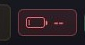
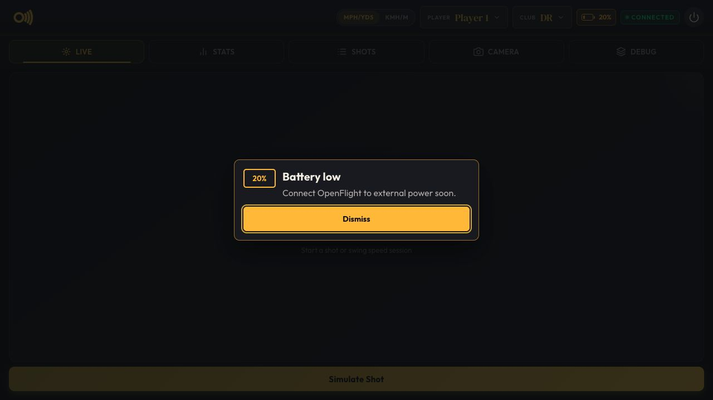
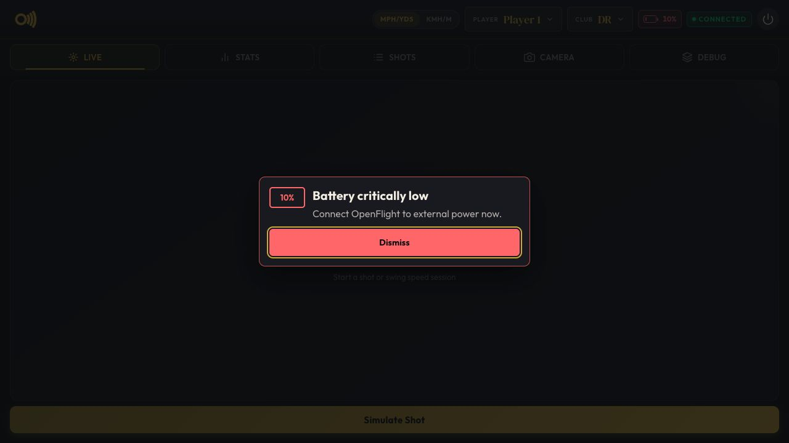
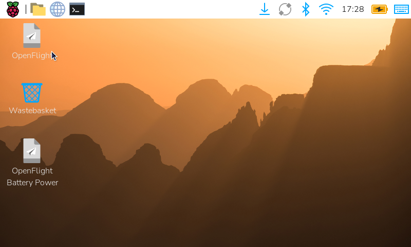

# Battery Monitoring

OpenFlight can display battery percentage, external-power state, and low-battery
warnings when a supported UPS provider is selected. Monitoring is disabled by
default and is read-only: OpenFlight does not change charging behavior or shut
down Linux automatically.

## Supported Providers

| Provider | CLI value | Hardware | Setup guide |
|---|---|---|---|
| Geekworm | `geekworm` | X1202 and X1206 | [Geekworm X1202/X1206](../build/battery.md) |

Start OpenFlight with an installed provider:

```bash
scripts/start-kiosk.sh --battery geekworm
```

The `--battery` argument is intentionally explicit. When it is absent,
OpenFlight does not probe UPS hardware and does not show the battery UI.

## Implementation

Battery support is split into generic monitoring and hardware providers:

```text
CLI provider selection
        |
        v
PowerReader factory --> Linux power_supply reader
        |                       |
        | unavailable           | PowerSample
        v                       v
Provider reader ----------> PowerMonitor --> WebSocket UI
                                      `--> session JSONL
```

Every provider implements the `PowerReader` contract and returns the common
`PowerSample` fields:

- Battery percentage
- Battery voltage
- External-power availability

The factory first uses standard Linux devices under `/sys/class/power_supply`
when the installed kernel driver exposes both a battery and mains supply. It
falls back to the selected provider's direct hardware reader when native Linux
telemetry is unavailable.

The generic `PowerMonitor` owns polling, retry, state classification, UI
publication, and throttled session logging. Hardware readers do not implement
warnings or shutdown policy.

## UI And Logging

The UI reports plugged-in, on-battery, low, critical, and unavailable states.
Warnings at 20% and 10% are dismissible and appear only while discharging.


### Indicator States

| Plugged in | On battery | Low | Critical | Unavailable |
|---|---|---|---|---|
|  |  |  |  |  |

### Warning Dialogs

| Low battery | Critically low battery |
|---|---|
|  |  |

Session logs contain `power_status` records with the provider, percentage,
voltage, external-power state, availability, timestamp, and any read error.
The session-start configuration also records the selected provider.

## Raspberry Pi Taskbar Compatibility

Raspberry Pi's `wfplug-batt` panel normally calculates percentage from charge
or energy counters. Some standard Linux battery drivers expose an already
calculated `capacity` value instead. OpenFlight's shared taskbar patch adds
support for that standard property, reads the external supply's standard
`online` state for the charging icon, and clamps full-charge overshoot to 100%.
Reading `online` avoids showing a charging icon when a battery driver reports
its charge state as `Unknown` while the external supply is disconnected.



The shared ARM64 Raspberry Pi OS Trixie package and source patch are stored at:

```text
scripts/battery/packages/
scripts/battery/patches/
```

This compatibility package is not Geekworm-specific. A provider setup script
may install it when that provider's Linux driver needs capacity-only support.
It affects only the Raspberry Pi desktop panel; OpenFlight's UI reads the same
Linux telemetry directly and does not require the panel package.

## Adding A Provider

Add hardware integrations under `src/openflight/power/providers/`, register the
provider name and reader in `src/openflight/power/factory.py`, and add focused
reader and factory tests. Provider-specific Pi provisioning belongs under
`scripts/battery/<provider>/`, with its operator guide under `docs/battery/`.

Keep provider readers read-only. Any future controlled shutdown behavior must
remain a separate policy that first stops OpenFlight cleanly, asks Linux to
halt, and only then allows the UPS to remove Pi power.
